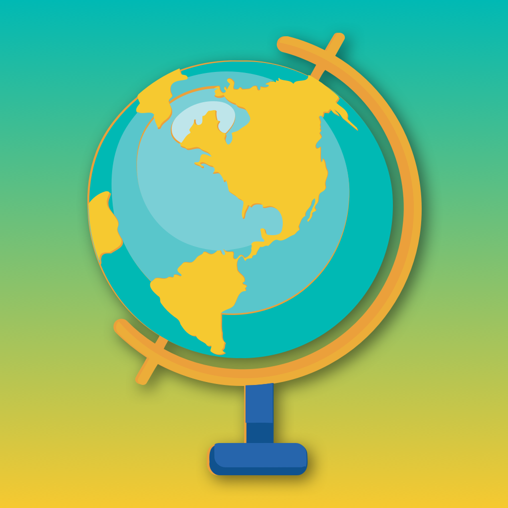
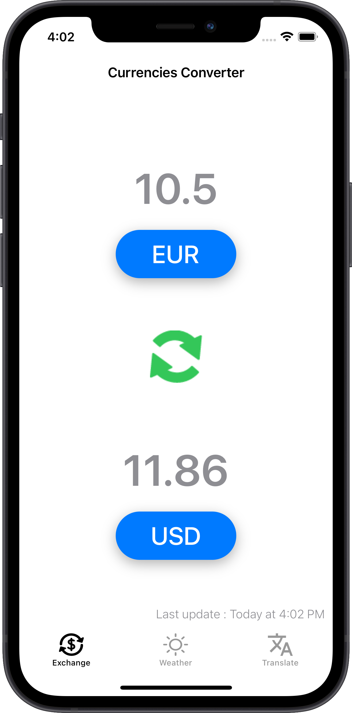
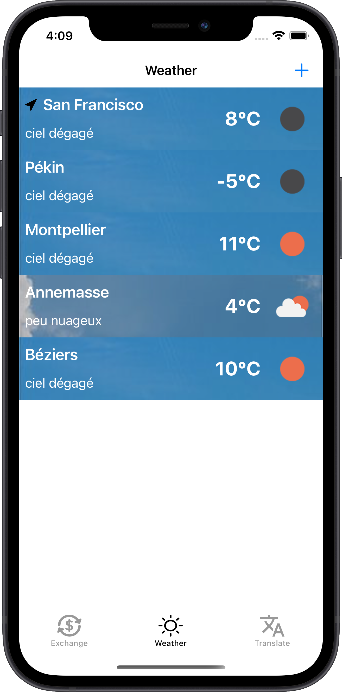
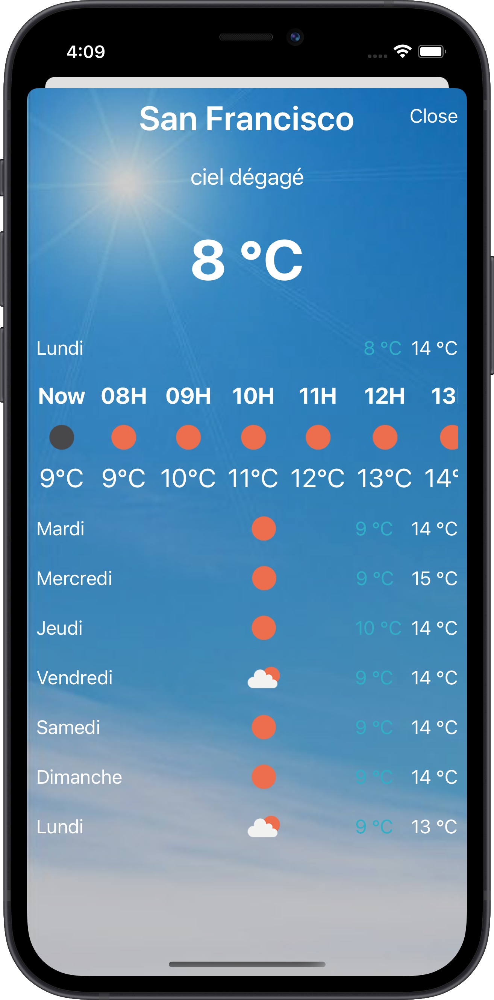
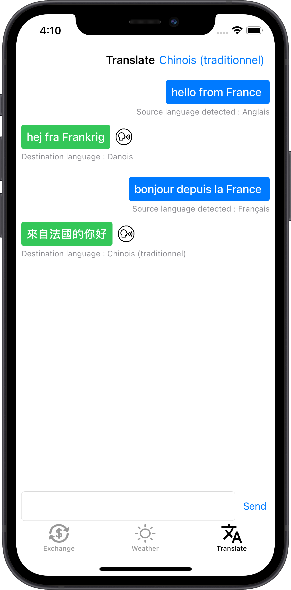

# Ulatimate Traveller Tools

<div align="center">
    
    <p>
    Ultimate Traveller Tool is the fourth coded protect of my training at OpenClassRooms.<br>
    If you wanna see the others, checkout my <a href="https://github.com/imick666/OpenClassRooms"> dedicated repo</a>
    </p>
</div>

## Sommary
- [Description](#description)
- [What I Learned](#what-i-learned)
- [How to use](#how-to-use)
- [Screenshots](#screenshots)
- [Sources](#sources)

## Description

Ultimate Traveller Tool is a travel backpack with imposed features :

- Get the exchange rate between dollar and euros (I decided to change any currency to any other).
- Translate from your favorite language into English (I decided to detect the origin language, translate to any other, and have the translation spoken on the phone)
- Compare the local weather with that of your home (I decided make an Apple Weather app "clone")

## What I learned

- Use generics
- Use LocationManager
- Use UITabBarController
- Make network calls and process responses
- Moke URLSeesion for test network calls
- Use APIs documentations
- Speech Synthesis

## How to use

This project use 4 api keys (that I don't share, they are mine ^^).

- [Fixer.io](https://fixer.io)
    
    - [Latest Rest Endpoint](https://fixer.io/documentation#latestrates)
- [Onpen Weather](https://openweathermap.org/api)
    
    - [Current Weather Api](https://openweathermap.org/current)
    - [One Call](https://openweathermap.org/api/one-call-api)
- [Google Cloud Platform](https://cloud.google.com)
    
    - Google Places
        
        - [Google Places Autocomplete](https://developers.google.com/maps/documentation/places/web-service/autocomplete)
    - Cloud Translation

        - [Discovering supported languages](https://cloud.google.com/translate/docs/basic/discovering-supported-languages)
        - [Detecting language](https://cloud.google.com/translate/docs/basic/detecting-language)
        - [Translating text](https://cloud.google.com/translate/docs/basic/translating-text)


Anywhere you want, create a file called "ApiConfig.swift". Don't forget to add it to the target "UltimateTravellerTool".

In this file, copy and paste the following code:

```Swift
struct ApiConfig {
    static let weatherApiKey = "" // Paste your weather api key here
    static let googlePlacesApiKey = "" // Paste your Google api key here
    static let fixerApiKey = "" // Paste your fixer api key here
    static let googleTranslateApiKey = "" // Paste your Google api keuy here
}
```

I used diiferents api keys for Google translate ans Goole places. If you want, you can use a single key for both of them.

Add your api keys in the file build the project.


## Screenshots

<div float="left">
    
    
    
    
</div>

## Sources

- Globe icon: [freesvg.org](https://freesvg.org/) by OpenClipart
- App assets: If you reconize your work, send me a message for I add you in this section. I found all the assets by losing myself on google and I don't remember where a found them


